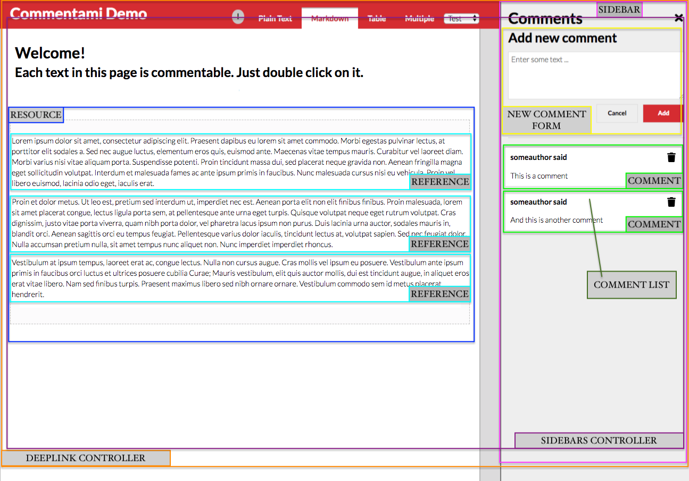

# Frontend Examples

This example will show you how to use the React components to build and customize the client.

## A commentable page

We have a sample text a we would like to make it commentable.

```
  <h1>Welcome!</h1>
  <h2>Each text in this page is commentable. Just double click on it.</h2>
  <p>
    Lorem ipsum dolor sit amet, consectetur adipiscing elit. Praesent dapibus eu lorem sit amet commodo. Morbi
    egestas pulvinar lectus, at porttitor elit sodales a. Sed nec augue luctus, elementum eros quis, euismod
    ante. Maecenas vitae tempus mauris. Curabitur vel laoreet diam. Morbi varius nisi vitae aliquam porta.
    Suspendisse potenti. Proin tincidunt massa dui, sed placerat neque gravida non. Aenean fringilla magna
    eget sollicitudin volutpat. Interdum et malesuada fames ac ante ipsum primis in faucibus. Nunc malesuada
    cursus nisi eu vehicula. Proin vel libero euismod, lacinia odio eget, iaculis erat.
  </p>
  <p>
    Proin et dolor metus. Ut leo est, pretium sed interdum ut, imperdiet nec est. Aenean porta elit non elit
    finibus finibus. Proin malesuada, lorem sit amet placerat congue, lectus ligula porta sem, at pellentesque
    ante urna eget turpis. Quisque volutpat neque eget rutrum volutpat. Cras dignissim, justo vitae porta
    viverra, quam nibh porta dolor, vel pharetra lacus ipsum non purus. Duis lacinia urna auctor, sodales
    mauris in, blandit orci. Aenean sagittis orci eu tempus feugiat. Pellentesque varius dolor iaculis,
    tincidunt lectus at, volutpat sapien. Sed nec feugiat dolor. Nulla accumsan pretium nulla, sit amet tempus
    nunc aliquet non. Nunc imperdiet imperdiet rhoncus.
  </p>
  <p>
    Vestibulum at ipsum tempus, laoreet erat ac, congue lectus. Nulla non cursus augue. Cras mollis vel ipsum
    eu posuere. Vestibulum ante ipsum primis in faucibus orci luctus et ultrices posuere cubilia Curae; Mauris
    vestibulum, elit quis auctor mollis, dui est tincidunt augue, in aliquet eros erat vitae libero. Nam sed
    finibus turpis. Praesent maximus libero sed nibh ornare ornare. Vestibulum commodo sem id metus placerat
    hendrerit.
  </p>
```

To make the page commentable we need to do various steps:
  * Define the commentable area
  * Assign the reference to the text blocks
  * Add a sidebar that allow to add a new comment to a reference...
  * ...and shows the comments added.
  * Add a deeplink manager that takes the url properties and open the sidebar in the right position with the comment highlighted

Let's start checking how the structure will be ate the end of the process. In the image below you can see how the Commentami Components are used.

***In the image below an example of commentable page.***


A comment is located in the system using 2 positional identifiers:

* resource
* reference

The `resource` identifies the area (eg. a page, a table) and the `reference` indentifies the specific part of the resource (eg. a text block, a cell)

### Resource
To define a commentable area the `<Resource>` component is used.

Given the previous page definition we would like to define the `<p>` commentable, as a first step we need to wrap the block inside the `<Resource>` component and assign a `resource` identifier.
```
  <h1>Welcome!</h1>
  <h2>Each text in this page is commentable. Just double click on it.</h2>
  <Resource resource="resource-1">
    <p>
      Lorem ipsum dolor sit amet, consectetur adipiscing elit. Praesent dapibus eu lorem sit amet commodo. Morbi
      egestas pulvinar lectus, at porttitor...
    </p>
    <p>
      Proin et dolor metus. Ut leo est, pretium sed interdum ut, imperdiet nec est. Aenean porta elit non elit
      finibus finibus. Proin malesuada...
    </p>
    <p>
      Vestibulum at ipsum tempus, laoreet erat ac, congue lectus. Nulla non cursus augue. Cras mollis vel ipsum
      eu posuere. Vestibulum ante ipsum primis...
      hendrerit.
    </p>
  </Resource>
```

### Reference
Now that the area is defined the `<p>` blocks should be tagged as a `reference` using the `<Reference>` component.

```
  <h1>Welcome!</h1>
  <h2>Each text in this page is commentable. Just double click on it.</h2>
  <Resource resource="resource-1">
    <Reference reference="p1">
      <p>
        Lorem ipsum dolor sit amet, consectetur adipiscing elit. Praesent dapibus eu lorem sit amet commodo. Morbi
        egestas pulvinar lectus, at porttitor...
      </p>
    </Reference>
    <Reference reference="p2">
      <p>
        Proin et dolor metus. Ut leo est, pretium sed interdum ut, imperdiet nec est. Aenean porta elit non elit
        finibus finibus. Proin malesuada...
      </p>
    </Reference>
    <Reference reference="p3">
      <p>
        Vestibulum at ipsum tempus, laoreet erat ac, congue lectus. Nulla non cursus augue. Cras mollis vel ipsum
        eu posuere. Vestibulum ante ipsum primis...
        hendrerit.
      </p>
    </Reference>
  </Resource>
```

The `<Reference>` component provided with the library implements the basic feature to interact with the others UI components. It requires to be in a SidebarsControllers to works.

### SidebarsController
The sidebar controller provides the feature to interact with the layout and manage the DoubleClick event that opens the sidebar to interact with a `reference`.

```
  <SidebarsController>
    <h1>Welcome!</h1>
    <h2>Each text in this page is commentable. Just double click on it.</h2>
    <Resource resource="resource-1">
      <Reference reference="p1">
        <p>
          Lorem ipsum dolor sit amet, consectetur adipiscing elit. Praesent dapibus eu lorem sit amet commodo. Morbi
          egestas pulvinar lectus, at porttitor...
        </p>
      </Reference>
      <Reference reference="p2">
        <p>
          Proin et dolor metus. Ut leo est, pretium sed interdum ut, imperdiet nec est. Aenean porta elit non elit
          finibus finibus. Proin malesuada...
        </p>
      </Reference>
      <Reference reference="p3">
        <p>
          Vestibulum at ipsum tempus, laoreet erat ac, congue lectus. Nulla non cursus augue. Cras mollis vel ipsum
          eu posuere. Vestibulum ante ipsum primis...
          hendrerit.
        </p>
      </Reference>
    </Resource>
  <SidebarsController>
```

### Sidebar
Now that the SidebarController was added we need to add a Sidebar.
The Sidebar interact with the controller and provides the Form to add new comment and the list of existing comments.
***The SideBar should be added inside the Resource component***

```
  <SidebarsController>
    <h1>Welcome!</h1>
    <h2>Each text in this page is commentable. Just double click on it.</h2>
    <Resource resource="resource-1">
      <Reference reference="p1">
        <p>
          Lorem ipsum dolor sit amet, consectetur adipiscing elit. Praesent dapibus eu lorem sit amet commodo. Morbi
          egestas pulvinar lectus, at porttitor...
        </p>
      </Reference>
      <Reference reference="p2">
        <p>
          Proin et dolor metus. Ut leo est, pretium sed interdum ut, imperdiet nec est. Aenean porta elit non elit
          finibus finibus. Proin malesuada...
        </p>
      </Reference>
      <Reference reference="p3">
        <p>
          Vestibulum at ipsum tempus, laoreet erat ac, congue lectus. Nulla non cursus augue. Cras mollis vel ipsum
          eu posuere. Vestibulum ante ipsum primis...
          hendrerit.
        </p>
      </Reference>
      </SideBar>
    </Resource>
  </SidebarsController>
```

### Backend socket integration
The connection with the backend is done passing a `service` directly in the `<Resource>` component.


```javascript
import { WebsocketService, buildWebsocketClient } from '@nearform/commentami-react-components'

// Create the client and initilize the right authorization params
const client = buildWebsocketClient('ws://127.0.0.1:8080')
await client.connect({ auth: { headers: { authorization: this.props.authorization } } })

// Create the service
const websocketService =  WebsocketService(client)

// Assign the service
...
  <Resource resource="resource-1" service={websocketService}>
...
```

### Use the deeplinking
Adding a `<DeepLinkController>` it's possible to access directly to a comment using a deeplink URL in the format `http://someurl/somepage/?resource=RESOURCE&reference=REFERENCE&comment=12345`

```
<DeepLinkController>
  <SidebarsController>
    <h1>Welcome!</h1>
    <h2>Each text in this page is commentable. Just double click on it.</h2>
    <Resource resource="resource-1">
      ...
    </Resource>
  </SidebarsController>
</DeepLinkController>
```

The page will be loaded directly with teh Sidebar opened and scrolled to the comment linked.

### The full implementation

```
<DeepLinkController>
  <SidebarsController>
    <h1>Welcome!</h1>
    <h2>Each text in this page is commentable. Just double click on it.</h2>
    <Resource resource="resource-1">
      <Reference reference="p1">
        <p>
          Lorem ipsum dolor sit amet, consectetur adipiscing elit. Praesent dapibus eu lorem sit amet commodo. Morbi
          egestas pulvinar lectus, at porttitor...
        </p>
      </Reference>
      <Reference reference="p2">
        <p>
          Proin et dolor metus. Ut leo est, pretium sed interdum ut, imperdiet nec est. Aenean porta elit non elit
          finibus finibus. Proin malesuada...
        </p>
      </Reference>
      <Reference reference="p3">
        <p>
          Vestibulum at ipsum tempus, laoreet erat ac, congue lectus. Nulla non cursus augue. Cras mollis vel ipsum
          eu posuere. Vestibulum ante ipsum primis...
          hendrerit.
        </p>
      </Reference>
      </SideBar>
    </Resource>
  </SidebarsController>
</DeepLinkController>
```

### `<Commentami>` component
The example above can be rewritten quickly using the `<Commentami>` component.

```
<Commentami resource="resource-1" service={service}>
  <h1>Welcome!</h1>
  <h2>Each text in this page is commentable. Just double click on it.</h2>
  <Reference reference="p1">
    <p>
      Lorem ipsum dolor sit amet, consectetur adipiscing elit. Praesent dapibus eu lorem sit amet commodo. Morbi
      egestas pulvinar lectus, at porttitor...
    </p>
  </Reference>
  <Reference reference="p2">
    <p>
      Proin et dolor metus. Ut leo est, pretium sed interdum ut, imperdiet nec est. Aenean porta elit non elit
      finibus finibus. Proin malesuada...
    </p>
  </Reference>
  <Reference reference="p3">
    <p>
      Vestibulum at ipsum tempus, laoreet erat ac, congue lectus. Nulla non cursus augue. Cras mollis vel ipsum
      eu posuere. Vestibulum ante ipsum primis...
      hendrerit.
    </p>
  </Reference>
</Commentami>
```

The Commentami component has a limitation, it allow only one Resource per page, but if you don't need many resource in a page allows to quickly make a page commentable.

