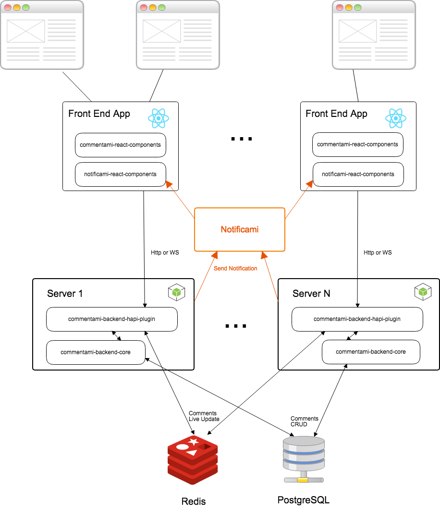

# Real time notifications and deep linking

In our system a notification object has the following model:

```
{
  comment: {
    ...
  },
  action: '...',
  url: '...'
}
```
The `comment` property is an object representing the commet related to the user notification. It has the same interface described in the main [documentation page](/#core-concepts).

The `action` property will be either `mention` or `involve`. With `mention` we mean that the user has been explicitly mentioned in the content of the comment. With `involve` we mean that a new comment has been added to a `resouce`/`reference` pair the user already commented on (aka: someone answered to her comment).

Last but not least `url`. This property is optional and it should contain a link to the comment.

A notification is sent

It's value is saved as the `author` of a comment and in the `mentions` array if one or more mentions `@<username>` are found in the comment content.


## Notification logic

As of today, the server uses the users `username` to identify a user.

The mentions notifications process is automatic and will happen even if there is no authentication in place. As long as a client subscribe to the right channel (ie: `/users/{username}`), it will get notified if a mention happens.

The "answers to comment" notification process needs one of the following:

- the client provides an `author` field when adding a comment, or
- an [authentication strategy and the `getUserFromRequest` option](/example-auth-and-user-data#add-authentication)

Lastly, to create a deep link to the comment you should implement a `resolveUrl` function and pass it as follow to the plugin

```javascript
await server.register([{
  plugin: require('@nearform/commentami-backend-hapi-plugin'),
  options: {
    // ...,
    resolvers: {
      resolveUrl: async (comment) => {
        // ... given the comment, it returns the page that contains the specific resource/reference

        return baseUrl
      }
    }
  }
}])
```

This function should return the url relative to the comment's resource (ie: `http://www.my.site/the/page/of/the/resource`)

The plugin will then add its query parameters so that the react components will be able to understand what is the resource, reference and comment to show.

## Backend

To enable the notifications the `commentami` platform uses the external service [notificami](https://github.com/nearform/notificami).



### Configuration
To configure the service, add a property `notifications` in the `pluginOptions` property.


|Propery|Type|Description|
|----|------|-------|
|`enabled`|boolean|define if the notifications are enabled|
|`endPoint`|string|the notification POST endpoint|


```
const config = {
  server: {
    ...
  },
  pluginOptions: {
    notifications: {
      enabled: true,
      endPoint: 'http://localhost:8482/notifications'
    },
    ...
  }
}
```


## Frontend
In the client side `notificami` provides a ready to use widget: [notificami-react-components](https://github.com/nearform/notificami/tree/master/packages/notificami-react-components).

### Add to a page
The widget should be embedded in the NotificamiProvider that manage the connection with the server and pass the context to the widget.

```
import { WebsocketService, buildWebsocketClient, NotificamiProvider, NotificamiWidget } from '@nearform/notificami-react-component'

const client = buildWebsocketClient('ws://127.0.0.1:8482')
client.connect()

class SamplePage extends React.Component {
  render() {
    return (
      <NotificamiProvider userIdentifier='davide' service={WebsocketService(client)}>
        <div id='toolbar'>
          <NotificamiWidget />
        </div>
      </NotificamiProvider>
    )
  }
}
```
